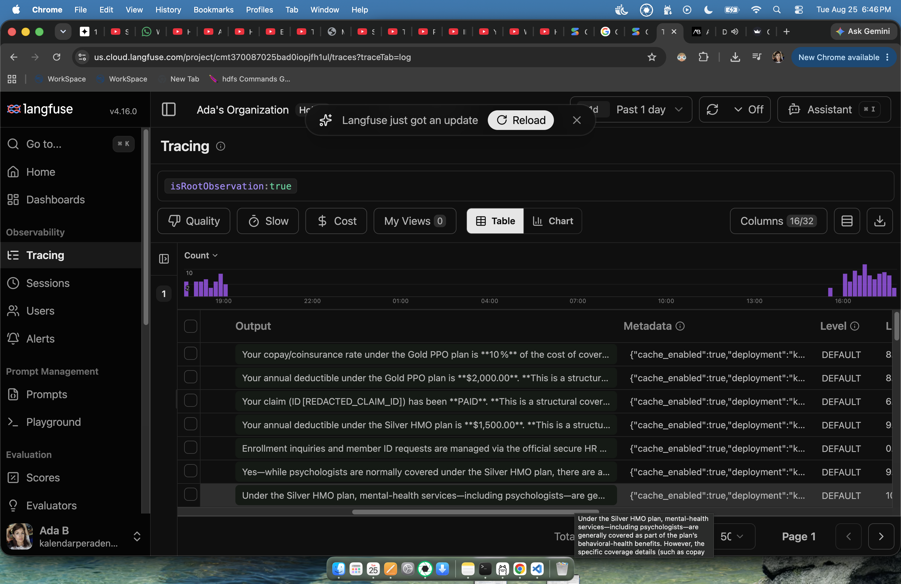

Results of different kinds of questions asked to the chatbot

-------------------------------------------------------------------------------------------------------------
------A structured coverage question

What is my deductible under silver plan

🛡️
Your annual deductible under the Silver HMO plan is $1,500.00.

This is a structural coverage determination. Not medical advice.

🛡️ Policy Coverage Summary
Plan Tier

Silver HMO

Annual Deductible

$1,500.00

Cost-Sharing Copay Rate

20%

Policy Status

✅ Approved Coverage

-------------------------------------------------------------------------------------------------------------
-------A policy-wording question

What is my copay under gold plan

🛡️
Your copay/coinsurance rate under the Gold PPO plan is 10 % of the cost of covered services.

This is a structural coverage determination. Not medical advice.

🛡️ Policy Coverage Summary
Plan Tier

Gold PPO

Annual Deductible

$2,000.00

Cost-Sharing Copay Rate

10%

-------------------------------------------------------------------------------------------------------------
------A claim-status lookup

What is the status of my claim

🛡️
Your claim (ID [REDACTED_CLAIM_ID]) has been PAID.

This is a structural coverage determination. Not medical advice.

📄 Medical Claim Summary Details
Claim ID

CLM9901

Adjudication State

🟢 Paid

Processed Value

$450.00

Filing Date

2026-08-24

-------------------------------------------------------------------------------------------------------------
-------A multi-turn follow-up
Is a psychologist covered under Silver plan?

🛡️
Under the Silver HMO plan, mental‑health services—including psychologists—are generally covered as part of the plan’s behavioral‑health benefits. However, the specific coverage details (such as copay amounts, network restrictions, or limits on visits) are not listed in the excerpt you provided. To confirm the exact terms—especially whether the psychologist must be in‑network, what the copay or coinsurance will be, and whether there are any visit limits—please review the plan’s Evidence of Coverage (EOC) or contact Member Services.

This is a structural coverage determination. Not medical advice.

🛡️ Policy Coverage Summary
Plan Tier

Silver HMO

Annual Deductible

$1,500.00

Cost-Sharing Copay Rate

20%

Policy Status

❌ Policy Exclusion

👤
------Are there situations when it is not covered?

🛡️
Yes—while psychologists are normally covered under the Silver HMO plan, there are a few common scenarios in which a visit might not be paid:

Situation	Why it may not be covered	What to do
Out‑of‑network provider	The Silver HMO is a closed‑network plan. Services from a psychologist who is not on the Kaiser Permanente network are usually excluded.	Verify the provider’s network status before the appointment.
Excluded mental‑health services	Some plans exclude certain specialty mental‑health treatments (e.g., certain types of psychotherapy, experimental therapies, or services that are considered “non‑essential”).	Check the “Exclusions” section of the benefits document or the Evidence of Coverage (EOC).
Prior‑authorization not obtained	Many behavioral‑health services require prior authorization. If the psychologist’s visit is for a service that needs it and the authorization was not secured, the claim may be denied.	Request prior authorization from the psychologist’s office or from Member Services.
Visit limits or caps	The plan may impose a maximum number of covered visits per year for certain mental‑health services. Exceeding that limit can result in out‑of‑pocket costs.	Review the plan’s visit limits in the EOC.
Non‑covered conditions	If the psychologist is treating a condition that the plan specifically excludes (e.g., certain substance‑use disorders that are not covered under the behavioral‑health benefit), the visit may not be paid.	Confirm the covered conditions list in the EOC.
Bottom line: Psychologists are generally covered under the Silver HMO, but coverage can be denied if the provider is out of network, the service is excluded, prior authorization is missing, visit limits are exceeded, or the condition itself is excluded. Always check the Evidence of Coverage or call Member Services for the most accurate, up‑to‑date information before scheduling an appointment.

This is a structural coverage determination. Not medical advice.

🛡️ Policy Coverage Summary
Plan Tier

Silver HMO

Annual Deductible

$1,500.00

Cost-Sharing Copay Rate

20%

Policy Status

❌ Policy Exclusion
-------------------------------------------------------------------------------------------------------------------One adversarial / off-topic question

Tell me a story about trees

🛡️
Enrollment inquiries and member ID requests are managed via the official secure HR Portal. Please log in to your dashboard to complete these updates.

-------------------------------------------------------------------------------------------------------------
LANGFUSE TRACING

Session Trace: e5b1a836

Snapshot attached of the Langfuse UI with traces
Traces are visible on the LangFuse UI

